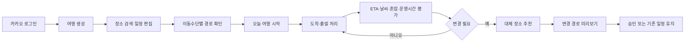
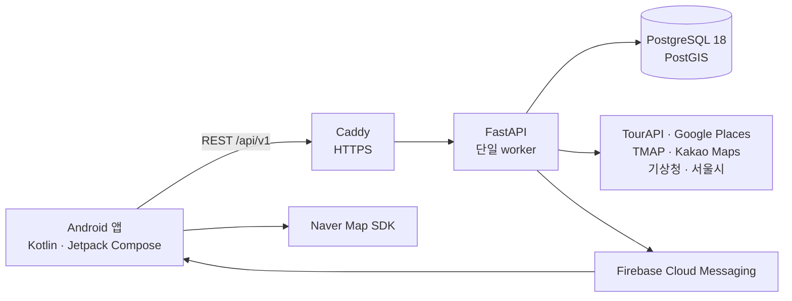

# 길픽 (Gilpick)

[](https://github.com/angry-cat55/gil-pick/actions/workflows/backend-ci.yml)
[](https://github.com/angry-cat55/gil-pick/actions/workflows/android-ci.yml)
[](https://github.com/angry-cat55/gil-pick/actions/workflows/deploy-aws.yml)

> 여행 중 날씨·혼잡도·운영시간 변화를 감지하고, 방문하기 어려워진 장소의 대안과 변경 경로를 제안하는 Android 여행 일정 서비스

길픽은 여행 계획을 만드는 데서 끝나지 않습니다. 사용자가 여행을 시작하면 실제 진행 상태와 도착 예정 시각을 관리하고, 남은 일정의 변수를 주기적으로 평가해 필요한 경우 대체 장소와 경로를 제안합니다. 위치 권한이나 외부 API가 불완전한 상황에서도 수동 진행과 기존 일정은 유지하도록 설계했습니다.

## 핵심 사용자 흐름



## 주요 기능

| 영역 | 구현 내용 |
|---|---|
| 인증·계정 | 카카오 로그인, Access/Refresh Token 회전, 기기별 로그아웃, 계정 탈퇴와 재가입 |
| 여행 관리 | 최대 7일 여행 생성·조회·수정·논리 삭제, 기간 중복 방지, 검색·상태 필터, 대표 이미지 |
| 장소·일정 | TourAPI 중심 장소 검색·상세, 제한적 Google Places 보완, 날짜별 장소·순서·체류시간·이동수단 편집 |
| 경로 | TMAP 도보·자동차, Kakao Maps 대중교통 경로 계산, Naver Map 지도 표시, 실패 후 재계산 |
| 여행 진행 | 첫 장소 이동·현장 시작, 수동 도착·출발·건너뛰기, ETA 재계산, 당일 완료 |
| 위치 감지 | 300m DWELL 도착 감지, 400m EXIT 출발 감지, 확인·자동 확정·되돌리기 |
| 변수 감지 | 남은 일정의 ETA 기준 날씨·혼잡도·운영시간 평가와 중복 감지 억제 |
| 대체 장소 | 0.5km → 1km → 2km 후보 탐색, 거리·평점·혼잡·날씨 점수화, 직접 검색 |
| 일정 변경 | 후보 경로 미리보기, 승인 시 일정·경로 원자적 변경, 30초 이내 되돌리기 |
| 알림·설정 | FCM 도착·출발 확인과 장소 변경 제안, 알림 목록·딥링크, 제안 알림 ON/OFF |

세부 정책과 완료 조건은 [MVP 정의](docs/planning/mvp.md), [기능 명세](docs/planning/functional-spec.md), 각 Feature의 `specs/` 문서를 기준으로 합니다.

## 현재 개발 상태

2026-09-16 기준 Feature 상태입니다. `DONE`이 아닌 항목은 핵심 구현이 일부 병합되어 있어도 재작업 또는 전체 검증이 남아 있습니다.

| 상태 | Feature |
|---|---|
| `DONE` | F001 인증, F002 여행 관리, F003 장소 검색, F004 일정 구성, F005 경로 계산, F006 여행 진행, F007 위치 기반 감지, F008 여행 변수 감지, F011 알림 |
| `READY (재작업)` | F009 대체 장소 추천 |
| `IN_PROGRESS` | F010 일정 변경 |
| `VERIFY` | F012 사용자 설정 |

최신 상태와 전이 근거는 [MVP Feature 목록](docs/planning/mvp-features.md)에서 관리합니다.

## 시스템 구조



FastAPI lifespan에서 변수 감지, 알림 발송·정리, 인증 데이터 정리 반복 작업을 실행합니다. 작업이 worker마다 중복 생성되지 않도록 AWS 개발 환경은 Uvicorn 단일 worker로 운영합니다.

## 기술 스택

| 영역 | 기술 |
|---|---|
| Android | Kotlin 2.4, Jetpack Compose·Material 3, Navigation Compose, Retrofit·OkHttp, DataStore, WorkManager |
| 위치·지도 | Google Play Services Location·Geofencing, Naver Map SDK |
| Backend | Python 3.13, FastAPI, Pydantic, SQLAlchemy asyncio, AsyncPG, Alembic |
| Database | PostgreSQL 18, PostGIS |
| 인증·알림 | Kakao OAuth, JWT, Firebase Cloud Messaging |
| Infra | Docker Compose, AWS EC2·RDS, Caddy HTTPS, Cloudflare Pages |
| CI/CD | GitHub Actions, EC2 self-hosted deployment runner |

외부 API의 역할과 장애 처리 정책은 [기술 아키텍처](docs/decisions/tech-stack.md)와 [API 명세](docs/design/api-spec.md)를 참고하세요.

## 저장소 구조

```text
gilpick/
├─ android/            # Android 앱, Compose UI, 위치·지도·FCM 연동
├─ api/                # FastAPI, domain service, migration, test
├─ deploy/aws/         # Caddy와 Backend AWS Docker Compose 구성
├─ docs/               # 기획, API·ERD·UI, 배포·검증 문서
├─ specs/              # F001~F012 Spec Kit 산출물
├─ web/                # App Link assetlinks와 개인정보·이용약관 정적 파일
└─ .github/workflows/  # Backend CI, Android CI, AWS dev 배포
```

## 로컬 실행

### 1. Backend

준비물:

- Python 3.13
- [uv](https://docs.astral.sh/uv/)
- Docker Desktop 또는 Docker Engine

저장소 루트에서 PostgreSQL·PostGIS를 실행합니다.

```bash
docker compose up -d postgres
```

`api/.env.example`을 `api/.env`로 복사하고 placeholder를 로컬 개발값으로 교체합니다. 실제 key나 credential은 저장소에 commit하지 않습니다.

```bash
cd api
uv sync --frozen
uv run alembic upgrade head
uv run uvicorn app.main:app --reload
```

- Health check: `http://localhost:8000/health`
- OpenAPI UI: `http://localhost:8000/docs`

외부 API key가 없으면 해당 provider를 사용하는 실연동은 제한됩니다. 테스트 suite는 실제 운영 key 없이 실행할 수 있습니다.

### 2. Android

준비물:

- JDK 17
- Android Studio와 Android SDK 37
- Google Play가 포함된 emulator 또는 Android 기기

실제 개발 API에 연결하려면 사용자 Gradle 설정 또는 `-P` 옵션으로 API 주소를 주입합니다.

```powershell
cd android
$apiBaseUrl = "https://your-api.example.com/api/v1/"
.\gradlew.bat testDebugUnitTest
.\gradlew.bat :app:installDebug "-PGILPICK_API_BASE_URL=$apiBaseUrl"
```

선택 설정:

| 파일·property | 필요한 기능 |
|---|---|
| `android/app/google-services.json` | Firebase 초기화와 FCM 수신 |
| `GILPICK_NAVER_MAPS_CLIENT_ID` | Naver 지도 인증 |
| `GILPICK_DEBUG_KEYSTORE_PATH` | 팀 공용 debug 서명과 App Link 검증 |
| `GILPICK_PRIVACY_POLICY_URL` | 개인정보 처리방침 연결 |
| `GILPICK_TERMS_OF_SERVICE_URL` | 이용약관 연결 |
| `GILPICK_LOCATION_TERMS_URL` | 위치기반서비스 이용약관 연결 |

`google-services.json`, keystore, Firebase Admin 서비스 계정 JSON은 GitHub에 올리지 않습니다.

## 테스트

### Backend

```bash
cd api
uv run python -m compileall -q app tests
uv run pytest tests/unit -q
uv run pytest tests/contract -q
uv run pytest tests/integration -q
```

Integration test에는 PostgreSQL·PostGIS가 필요합니다. 실제 provider smoke test는 opt-in이며 운영 key가 없는 CI에서는 실행하지 않습니다.

### Android

```powershell
cd android
.\gradlew.bat testDebugUnitTest
.\gradlew.bat assembleDebug
```

Emulator가 연결된 환경에서는 다음으로 계측 테스트를 실행할 수 있습니다.

```powershell
.\gradlew.bat connectedDebugAndroidTest
```

## CI/CD와 배포

- **Backend CI**: 문법 검사 → Alembic migration → unit → contract → integration test
- **Android CI**: unit test → debug APK build → 테스트 HTML artifact 업로드
- **AWS dev CD**: `main`의 `api/**` 또는 `deploy/aws/**` 변경 시 EC2 self-hosted runner가 migration → image build → 재기동 → health check를 수행
- **수동 배포**: GitHub Actions `Deploy to AWS (dev)`에서 확인 문자열 `deploy`로 실행

Android 계측·실기기 테스트와 실제 외부 provider smoke test는 CI 범위가 아닙니다. AWS workflow는 개발 환경용이며 자동 rollback이나 무중단 배포를 제공하지 않습니다. 자세한 절차는 [CI 문서](docs/deployment/ci.md)와 [AWS 개발 환경 배포 문서](docs/deployment/aws-dev.md)를 참고하세요.

## 설계 원칙

- 사용자·여행 소유권은 인증된 사용자 ID로 검증합니다.
- 상태 변경 API는 optimistic version과 `Idempotency-Key`로 중복·동시 요청을 제어합니다.
- 여행 진행, 일정 변경, 되돌리기는 DB transaction으로 관련 상태를 함께 저장합니다.
- 외부 API 실패는 가능한 범위에서 격리하고, 일정이나 수동 진행 기능은 유지합니다.
- 좌표는 WGS84, 날짜 상태는 KST, 시각은 timezone-aware 값으로 처리합니다.
- secret은 환경변수와 GitHub/AWS 설정으로 주입하고 저장소에 보관하지 않습니다.

## 주요 문서

| 문서 | 내용 |
|---|---|
| [MVP 정의](docs/planning/mvp.md) | 제품 목표, 포함·제외 범위와 성공 조건 |
| [MVP Feature 목록](docs/planning/mvp-features.md) | F001~F012 진행 상태와 의존성 |
| [사용자 흐름](docs/planning/user-flow.md) | 여행 생성부터 진행·대체 장소 변경까지의 흐름 |
| [API 명세](docs/design/api-spec.md) | REST endpoint와 요청·응답 계약 |
| [ERD 명세](docs/design/er-schema.md) | 테이블, 제약조건, transaction 경계 |
| [UI 가이드](docs/design/ui-guidelines.md) | 화면 상태, 디자인 token, 접근성 기준 |
| [AWS 배포](docs/deployment/aws-dev.md) | 공유 개발 환경 구성과 운영 절차 |

## 팀

| 팀원 | GitHub | 기본 담당 |
|---|---|---|
| 유지환 | [@angry-cat55](https://github.com/angry-cat55) | Backend |
| 유태식 | [@xotlr467-cpu](https://github.com/xotlr467-cpu) | Backend |
| 신재영 | [@NKIA-SJY](https://github.com/NKIA-SJY) | Android |
| 전현서 | [@aihonte](https://github.com/aihonte) | Android |

개발은 GitHub Flow와 Spec Kit 기반 SDD로 진행하며, Issue별 branch·PR·review·squash merge 원칙을 사용합니다. 외부 라이브러리와 데이터 출처 고지는 [THIRD_PARTY_NOTICES.md](THIRD_PARTY_NOTICES.md)를 참고하세요.
