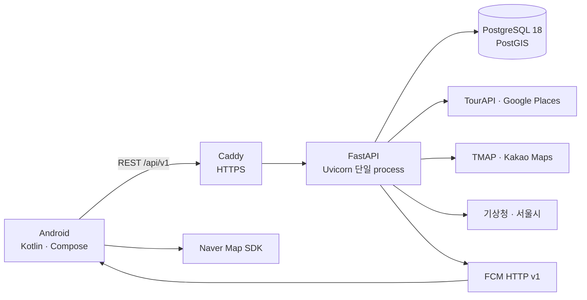

# 길픽 (Gilpick)

[](https://github.com/angry-cat55/gil-pick/actions/workflows/backend-ci.yml)
[](https://github.com/angry-cat55/gil-pick/actions/workflows/android-ci.yml)
[](https://github.com/angry-cat55/gil-pick/actions/workflows/deploy-aws.yml)

> 여행 도중 생기는 날씨·혼잡도·운영시간 변화를 감지하고, 방문하기 어려워진 장소의 대안과 변경 경로를 제안하는 Android 여행 일정 서비스

길픽은 일정을 저장하는 데서 끝나지 않습니다. 사용자가 여행을 시작하면 현재 진행 상태와 도착 예정 시각을 관리하고, 남은 장소의 변수를 주기적으로 평가합니다. 변경이 필요한 경우 기존 장소 주변의 대안을 추천하고, 사용자가 경로를 비교한 뒤 일정을 바꾸거나 그대로 유지할 수 있습니다.

## 핵심 사용자 흐름


## 구현 기능

| 영역 | 구현 내용 |
|---|---|
| 인증·계정 | 카카오 OAuth, verified App Link 복귀, Access/Refresh Token 회전, 기기별 로그아웃, 계정 탈퇴 |
| 여행 관리 | 최대 7일 여행 생성·조회·수정·논리 삭제, 기간 중복 방지, 검색·상태 필터, 대표 이미지 |
| 장소·일정 | TourAPI 중심 장소 검색·상세, 제한적 Google Places 보완, 날짜별 장소·순서·체류시간·이동수단 편집 |
| 경로 | TMAP 도보·자동차, Kakao Maps 대중교통 경로 계산, Naver Map 표시, 경로 재계산 |
| 여행 진행 | 첫 장소 이동·현장 시작, 수동 도착·출발·건너뛰기, ETA 재계산, 당일 완료 |
| 위치 감지 | Geofencing 기반 도착·출발 후보 생성, 사용자 확인, 자동 확정, 되돌리기 |
| 변수 감지 | 남은 장소의 ETA를 기준으로 날씨·혼잡도·운영시간 평가, 중복 감지 억제 |
| 장소 변경 | 반경별 대체 후보 추천과 직접 검색, 변경 경로 미리보기, 승인, 30초 이내 되돌리기 |
| 알림·설정 | FCM 진행 확인·장소 변경 알림, 알림 목록·딥링크, 장소 변경 제안 ON/OFF, 정책 문서 |

추천은 생성형 AI가 아니라 거리·평점·혼잡·날씨를 이용한 명시적 규칙과 가중치로 계산합니다. 제품 범위와 세부 정책은 [MVP 정의](docs/planning/mvp.md), [기능 명세](docs/planning/functional-spec.md), `specs/`의 Feature 문서를 기준으로 합니다.

## 시스템 구조



FastAPI lifespan에서 자체 `asyncio` 반복 작업으로 변수 감지, 알림 발송·정리, 인증 데이터 정리를 실행합니다. 이 작업이 중복 실행되지 않도록 현재 AWS 개발 환경은 Uvicorn 단일 process로 운영합니다.

## 기술 스택

| 영역 | 기술 |
|---|---|
| Android | Kotlin 2.4.10, Jetpack Compose, Material 3, Navigation Compose, ViewModel |
| Android data | Retrofit 3, OkHttp 5, Kotlinx Serialization, DataStore, WorkManager, Coil |
| 위치·지도·알림 | Google Play Services Location·Geofencing, Naver Map SDK, Firebase Messaging |
| Backend | Python 3.13, FastAPI, Pydantic, SQLAlchemy asyncio, AsyncPG, Alembic, GeoAlchemy2 |
| Database | PostgreSQL 18, PostGIS |
| Infra | Docker Compose, AWS EC2·RDS, Caddy HTTPS, GitHub Actions self-hosted runner |

주요 외부 연동은 다음과 같습니다.

| 목적 | 연동 |
|---|---|
| 로그인 | Kakao OAuth |
| 장소 | 한국관광공사 TourAPI, Google Places API (New) |
| 경로 | TMAP(도보·자동차), Kakao Maps(대중교통) |
| 변수 감지 | 기상청 단기예보, 서울시 실시간 도시데이터 |
| 알림 | Firebase Cloud Messaging HTTP v1 |
| 지도 | Naver Map Android SDK |

## 저장소 구조

```text
gilpick/
├─ android/            # Compose 앱, 위치·지도·FCM 연동
├─ api/                # FastAPI, domain service, migration, test
├─ deploy/aws/         # Caddy와 API의 AWS 개발 환경 구성
├─ docs/               # 기획, API·ERD·UI, CI/CD·운영 문서
├─ specs/              # F001~F012 Spec Kit 산출물
├─ web/                # App Link와 정책 문서 정적 원본
└─ .github/workflows/  # Backend CI, Android CI, AWS 개발 환경 배포
```

## 로컬 실행

### Backend

준비물은 Python 3.13, [uv](https://docs.astral.sh/uv/), Docker입니다.

1. `api/.env.example`을 `api/.env`로 복사하고 로컬 개발값을 입력합니다.
2. 저장소 루트에서 PostgreSQL·PostGIS를 실행합니다.
3. migration 후 API를 시작합니다.

```bash
docker compose --env-file api/.env up -d postgres
cd api
uv sync --frozen
uv run alembic upgrade head
uv run uvicorn app.main:app --reload
```

- Health check: `http://localhost:8000/health`
- OpenAPI UI: `http://localhost:8000/docs`

실제 외부 API key가 없으면 해당 provider의 실연동만 제한됩니다. 자동 테스트는 운영 key 없이 실행할 수 있습니다.

### Android

준비물은 JDK 17, Android Studio, Android SDK 37, Google Play가 포함된 emulator 또는 Android 기기입니다. 저장소의 기본 API 주소는 placeholder이므로 실제 실행 시 API 주소를 반드시 주입합니다.

```powershell
cd android
$apiBaseUrl = "https://your-api.example.com/api/v1/"
.\gradlew.bat testDebugUnitTest
.\gradlew.bat :app:installDebug "-PGILPICK_API_BASE_URL=$apiBaseUrl"
```

| 파일·property | 필요한 기능 |
|---|---|
| `android/app/google-services.json` | Firebase 초기화와 FCM 수신 |
| `GILPICK_NAVER_MAPS_CLIENT_ID` | Naver 지도 인증 |
| `GILPICK_DEBUG_KEYSTORE_PATH` | 팀 공용 debug 서명과 App Link 검증 |
| `GILPICK_PRIVACY_POLICY_URL` | 개인정보 처리방침 |
| `GILPICK_TERMS_OF_SERVICE_URL` | 이용약관 |
| `GILPICK_LOCATION_TERMS_URL` | 위치기반서비스 이용약관 |

`google-services.json`, keystore, Firebase 서비스 계정 JSON과 모든 API key는 commit하지 않습니다.

## 테스트

### Backend

```bash
cd api
uv run python -m compileall -q app tests
uv run pytest tests/unit -q
uv run pytest tests/contract -q
uv run pytest tests/integration -q
```

Integration test에는 PostgreSQL·PostGIS가 필요합니다. 실제 provider smoke test는 opt-in이며 운영 key가 없는 CI에서는 실행하지 않습니다.

### Android

```powershell
cd android
.\gradlew.bat testDebugUnitTest
.\gradlew.bat assembleDebug
```

Emulator 또는 기기가 연결된 환경에서만 계측 테스트를 실행합니다.

```powershell
.\gradlew.bat connectedDebugAndroidTest
```

## CI/CD와 AWS 개발 환경

- **Backend CI**: 문법 검사 → Alembic migration → unit → contract → integration test
- **Android CI**: JVM unit test → debug APK build → 테스트 report artifact 업로드
- **AWS dev CD**: `main`의 `api/**` 또는 `deploy/aws/**` 변경 시 EC2 self-hosted runner가 migration → image build·재기동 → health check를 수행
- **수동 배포**: GitHub Actions의 `Deploy to AWS (dev)` workflow에서 확인 문자열 `deploy`로 실행

Android 계측·실기기 테스트와 실제 외부 provider smoke test는 CI 범위가 아닙니다. AWS workflow는 공유 개발 환경용이며 무중단 배포나 자동 rollback을 제공하지 않습니다. 자세한 내용은 [CI 문서](docs/deployment/ci.md)와 [AWS 개발 환경 문서](docs/deployment/aws-dev.md)를 참고하세요.

## 검증 범위와 한계

- 장소 검색과 서울시 혼잡도 연동은 현재 **서울 중심**이며, 모든 지역을 동일 수준으로 지원하지 않습니다.
- 지도, FCM, Kakao 로그인, 실제 장소·경로·날씨·혼잡도 조회는 각 provider의 설정과 key가 있어야 종단간 동작합니다.
- AWS 부하 테스트에서 동일 계정 기반 읽기 세션 50개를 5분간 오류 없이 처리했고, 100개는 timeout으로 중단됐습니다. 이는 실제 사용자 50명을 항상 처리한다는 보장이 아닙니다.
- Backend는 단일 API process와 RDS 연결을 사용합니다. 다중 process·수평 확장과 자동 rollback은 현재 범위가 아닙니다.

측정 조건과 결과는 [AWS 부하 테스트 문서](docs/deployment/load-test.md)에 기록되어 있습니다.

## 주요 문서

| 문서 | 내용 |
|---|---|
| [MVP 정의](docs/planning/mvp.md) | 제품 목표와 포함·제외 범위 |
| [MVP Feature 목록](docs/planning/mvp-features.md) | F001~F012 상태와 의존성 |
| [사용자 흐름](docs/planning/user-flow.md) | 여행 생성부터 일정 변경까지의 흐름 |
| [API 명세](docs/design/api-spec.md) | REST endpoint와 요청·응답 계약 |
| [ERD 명세](docs/design/er-schema.md) | 테이블, 제약조건, transaction 경계 |
| [UI 가이드](docs/design/ui-guidelines.md) | 화면 상태, 디자인 token, 접근성 기준 |
| [CI/CD](docs/deployment/ci.md) | 자동 검증과 AWS 개발 환경 배포 |
| [AWS 배포](docs/deployment/aws-dev.md) | 공유 개발 환경 구성과 운영 절차 |

## 팀

| 팀원 | GitHub | 기본 담당 |
|---|---|---|
| 유지환 | [@angry-cat55](https://github.com/angry-cat55) | Backend |
| 유태식 | [@xotlr467-cpu](https://github.com/xotlr467-cpu) | Backend |
| 신재영 | [@NKIA-SJY](https://github.com/NKIA-SJY) | Android |
| 전현서 | [@aihonte](https://github.com/aihonte) | Android |

개발은 GitHub Flow와 Spec Kit 기반 SDD로 진행합니다. 외부 라이브러리와 데이터 출처는 [THIRD_PARTY_NOTICES.md](THIRD_PARTY_NOTICES.md)를 참고하세요.
