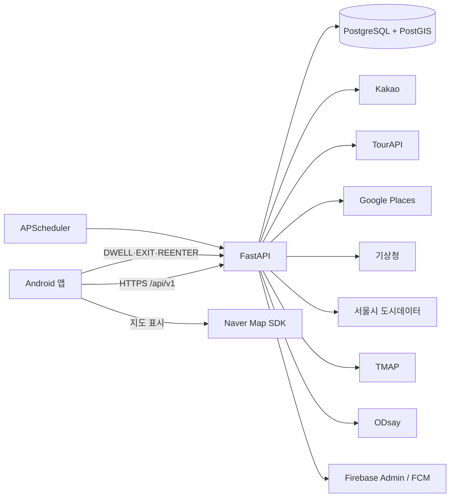

# 길픽 기술 아키텍처

## 1. 구성

## 2. 기술 스택과 책임

| 영역 | 기술 | 책임 |
|---|---|---|
| Android | Kotlin, Android SDK | 화면, 위치 권한, 지오펜스 등록, 알림 응답, 지도 표시 |
| 지도 | Naver Map SDK | 마커, 경로선, 현재 위치 표시 |
| API | FastAPI | 인증, 여행·일정·진행 상태, 추천, 외부 API 조정 |
| DB | PostgreSQL, PostGIS | 도메인 데이터, 버전, 이력, 반경 검색과 공간 판정 |
| 작업 | APScheduler | 단일 서버에서 10분 주기 변수 평가와 자동 확정 검사 |
| 알림 | Firebase Admin SDK, FCM | 변경 제안과 진행 확인 알림 |
| 배포 | Docker, AWS | 백엔드 실행 환경 |

## 3. 인증

1. Android 앱이 카카오 인가 코드를 FastAPI에 전달한다.
2. FastAPI가 카카오 토큰을 발급받고 사용자 정보를 검증한다.
3. 길픽 Access Token 1시간, Refresh Token 30일을 발급한다.
4. 앱은 토큰을 Android Keystore 기반 안전 저장소에 보관한다.
5. 기기별 Refresh Token을 DB에 저장해 다중 기기 로그인을 지원한다.
6. 로그아웃은 현재 기기의 Refresh Token만 폐기한다.

## 4. 여행·일정·경로

- UUID를 도메인 ID로 사용하고 KST 기준 날짜와 timezone 포함 시각을 구분해 저장한다.
- 일정 저장은 optimistic version을 사용해 동시 편집 충돌을 막는다.
- 경로 계산은 동기 방식이며 전체 최대 대기시간은 10초다.
- 외부 경로 호출은 5초 timeout과 1회 재시도를 적용한다.
- 일정 저장 후 경로가 실패하면 일정은 유지하고 `routeStatus=FAILED`를 기록한다.
- `경로 다시 계산`은 기존 일정을 입력으로 사용한다.
- ODsay 결과 사용 시 제공사 표시 정보를 앱에 전달한다.

## 5. 진행 상태와 지오펜스

### Android

- 상시 GPS 폴링 대신 Geofencing API를 사용한다.
- 다음 장소 도착용 300m DWELL 지오펜스와 현재 장소 출발용 400m EXIT 지오펜스를 별도 ID로 관리한다.
- 이벤트마다 UUID `eventId`, 발생시각, 좌표, 정확도, 이벤트 유형을 서버에 보낸다.
- 정밀·백그라운드 위치 권한이 없으면 해당 자동 기능만 비활성화한다.

### 서버 검증

- 자동 판정 입력은 정확도 100m 이하, 발생 후 2분 이내 이벤트로 제한한다.
- `eventId`와 transition 상태로 중복 처리를 방지한다.
- 도착 후보는 DWELL 5분 후 생성하고 후보 생성 5분 뒤 자동 확정한다.
- 출발 후보는 EXIT 후 생성하며 5분 동안 REENTER가 없을 때만 자동 확정한다.
- 자동 도착·출발 되돌리기 기한은 확정 후 5분이다.
- 도착 재알림은 10분 간격, 장소당 최대 2회다.
- 복합 전환과 마지막 장소 완료는 DB 트랜잭션으로 처리한다.

### ETA 재계산

- 여행 시작, 출발, 건너뛰기, 진행 중 체류시간·순서 변경, 수동 상태 변경, 대체 승인·되돌리기에서 영향받는 남은 구간만 다시 계산한다.
- 마지막 장소 도착 후에는 재계산 작업을 만들지 않는다.

## 6. 변수 감지와 추천

### 감지 파이프라인

1. APScheduler가 10분마다 진행 중인 당일 일정의 남은 장소를 조회한다.
2. 각 장소 ETA 기준으로 혼잡·날씨·운영시간을 조회한다.
3. 운영 종료·임시휴업은 Hard Constraint로 후보에서 제외한다.
4. Soft Constraint 점수를 계산하고 임계 조건을 만족하면 감지와 알림을 생성한다.
5. 같은 장소의 미결정 감지가 있으면 추가 알림을 만들지 않는다.

### 추천 계산

- PostGIS로 기존 장소 반경 0.5km, 1km, 2km 순서 검색
- TourAPI 분류를 서버 고정 매핑표로 내부 카테고리에 변환
- Google Places는 좌표 50m, 장소명 유사도, 주소 부분 일치 규칙으로 보강
- 점수 가중치: 거리 35, 베이지안 평점 30, 혼잡 20, 날씨 15
- 누락 제공자 데이터는 해당 변수만 제외하고 가중치 재정규화
- 상위 10개 반환, 거리·보정 평점·리뷰 수로 동점 해소

Google Places는 필요한 최소 field mask만 요청하며 서버 캐시는 사용하지 않는다. 매칭 또는 호출 실패 시 Google 기반 변수를 제외한다.

## 7. 외부 연동 실패

| 제공자 | timeout·재시도 | 실패 결과 |
|---|---|---|
| TourAPI | 5초·1회 | 관광 데이터 제외 |
| TMAP | 5초·1회 | 경로 실패 |
| ODsay | 5초·1회 | 경로 실패 |
| Google Places | 5초·1회 | Google 변수 제외 |
| 기상청 | 5초·1회 | 날씨 변수 제외 |
| 서울시 데이터 | 5초·1회 | 혼잡 변수 제외 |

## 8. 데이터 일관성과 보안

- 보호 API는 Access Token의 사용자 ID로 소유권을 확인한다.
- 성공·오류 응답은 공통 envelope를 사용하고 API 기본 경로는 `/api/v1`이다.
- 목록은 cursor 페이지네이션을 사용한다.
- 상태 변경에는 변경 전후 값, 처리 출처, 서버 처리시각을 기록한다.
- 대체 장소 승인은 미리보기와 일정 버전을 재검증하고 장소·경로·이력을 원자적으로 저장한다.
- 여행 삭제는 논리 삭제하며 연관 데이터를 일반 조회에서 제외한다.
- FCM payload에는 민감한 전체 도메인 객체 대신 재조회 식별자만 넣는다.

## 9. MVP 이후

- Redis 기반 캐시
- Celery 기반 분산 작업
- 다중 서버 스케줄러 중복 실행 방지
- 비동기 경로 계산과 작업 상태 조회
- 사용자별 감지 임계값
- 관광 수요·집중률 기반 지역 추천

