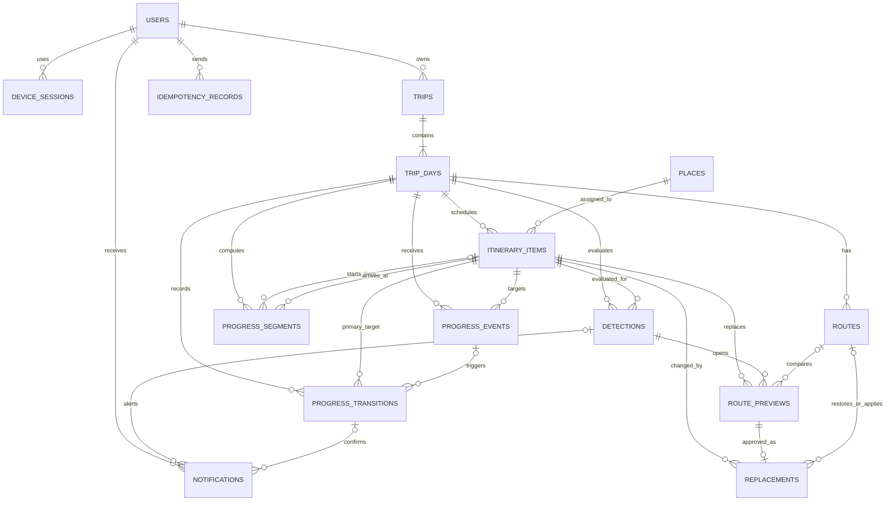

# 길픽 ER 스키마

- 버전: `1.0.0`
- 데이터베이스: PostgreSQL + PostGIS
- 기준 시간대: `Asia/Seoul`
- 기본키: UUID

## 1. 설계 원칙

- 여행은 `trips`, 날짜별 진행은 `trip_days`, 방문 장소는 `itinerary_items`로 분리한다.
- 여행 목록 상태는 시작일·종료일과 KST 현재 날짜로 계산하므로 `trips`에 중복 저장하지 않는다.
- 날짜별 실제 진행 상태와 일정 버전은 `trip_days`에 저장한다.
- 현재 장소 상태는 `itinerary_items`에 저장하고 모든 상태 변경 근거는 `progress_transitions`에 남긴다.
- 위치 이벤트와 최종 상태 변경을 분리한다. 지오펜스 이벤트만으로 일정 상태를 바로 변경하지 않는다.
- 계획 경로 구간은 개별 검색 대상이 아니므로 `routes.route_payload`에 저장한다. 여행 진행 중 계획 경로에 없는 시작·건너뛰기 구간만 `progress_segments`에 저장한다.
- 외부 API 원문, 평점·운영시간 캐시, 추천 후보 목록은 영구 테이블로 저장하지 않는다.
- 감지 평가값, 복합 상태 변경, 임시 경로처럼 수명이 짧은 스냅샷만 `jsonb`를 사용한다.
- 대체 경로 미리보기와 승인된 장소 변경은 분리한다.
- Refresh Token 원문은 저장하지 않고 해시만 저장한다.
- 인증 transaction은 terminal/expired 후 24시간, 만료·폐기 device session은 30일 뒤 삭제한다. 활성 사용자 profile은 계정 활성 기간에만 인증 목적으로 보관한다.
- 알림은 생성 후 90일 보관한 뒤 삭제하며, 여행을 논리 삭제하면 해당 여행에 연결된 알림도 정리한다.
- 사용자와 여행은 논리 삭제한다. 실제 purge를 수행할 때만 여행 하위 테이블을 `ON DELETE CASCADE`로 제거하며, 공유 장소인 `places`는 `RESTRICT`한다.

## 2. 테이블 구성

MVP는 16개 테이블로 구성한다.

| 영역 | 테이블 | 역할 |
|---|---|---|
| 사용자 | `users` | 카카오 사용자와 단일 알림 설정 |
| 인증·기기 | `device_sessions` | 기기별 Refresh Token과 FCM Token |
| 인증 transaction | `auth_login_transactions` | 카카오 `state`, 일회용 login ticket과 단기 사용자 snapshot |
| 여행 | `trips` | 여행 기본정보와 논리 삭제 |
| 여행 일자 | `trip_days` | 날짜별 진행 상태·시작시각·일정 버전 |
| 장소 | `places` | 일정에 필요한 최소 장소 참조정보 |
| 일정 | `itinerary_items` | 날짜별 방문 순서·체류시간·진행 상태 |
| 경로 | `routes` | 실제 일정에 적용된 경로 스냅샷 |
| 위치 이벤트 | `progress_events` | DWELL·EXIT·REENTER 입력과 중복 방지 |
| 상태 전환 | `progress_transitions` | 자동·수동 진행 변경과 되돌리기 근거 |
| 진행 구간 | `progress_segments` | 계획 경로에 없는 시작·건너뛰기 구간의 이동시간 |
| 변수 감지 | `detections` | 혼잡·날씨·운영시간 평가 사건 |
| 경로 미리보기 | `route_previews` | 승인 전 대체 경로 임시 데이터 |
| 장소 변경 | `place_replacements` | 승인된 장소·경로 변경과 되돌리기 |
| 알림 | `notifications` | 사용자 알림과 읽음 상태 |
| 멱등성 | `idempotency_records` | 중복 생성·승인 요청 방지 |

## 3. 전체 관계도



## 4. 사용자·인증

### 4.1 `users`

| 컬럼 | 타입 | NULL | 설명 |
|---|---|---:|---|
| `user_id` | uuid | N | PK |
| `social_provider` | varchar(20) | N | MVP 값 `KAKAO` |
| `social_subject` | varchar(255) | N | 카카오 사용자 식별자 |
| `nickname` | varchar(80) | Y | 표시 이름 |
| `profile_image_url` | text | Y | 프로필 이미지 |
| `replacement_suggestion_enabled` | boolean | N | 장소 변경 제안 알림, 기본 true |
| `created_at` | timestamptz | N | 생성 시각 |
| `updated_at` | timestamptz | N | 수정 시각 |
| `deleted_at` | timestamptz | Y | 탈퇴 시각 |

제약:

- `UNIQUE(social_provider, social_subject)`
- 사용자 설정이 한 개뿐이므로 별도 `user_preferences` 테이블을 만들지 않는다.

### 4.2 `device_sessions`

| 컬럼 | 타입 | NULL | 설명 |
|---|---|---:|---|
| `session_id` | uuid | N | PK |
| `user_id` | uuid | N | FK → `users.user_id` |
| `client_device_id` | varchar(255) | N | 앱이 생성한 기기 UUID |
| `platform` | varchar(20) | N | MVP 값 `ANDROID` |
| `refresh_token_hash` | varchar(64) | N | 현재 Refresh Token SHA-256 hex |
| `refresh_expires_at` | timestamptz | N | 발급 후 30일 |
| `revoked_at` | timestamptz | Y | 현재 기기 로그아웃 시각 |
| `fcm_token` | text | Y | 현재 기기의 FCM Token |
| `app_version` | varchar(40) | Y | 앱 버전 |
| `last_seen_at` | timestamptz | Y | 마지막으로 성공한 인증 요청 시각 |
| `created_at` | timestamptz | N | 생성 시각 |
| `updated_at` | timestamptz | N | 수정 시각 |

제약:

- `UNIQUE(user_id, client_device_id)`
- 활성 세션의 `fcm_token`은 partial unique index를 사용한다.
- 토큰 재발급 시 같은 세션 행의 해시와 만료시각을 교체한다.
- 만료·폐기된 기기 session은 상태 확정 후 30일 동안 진단 목적으로 보관한 뒤 삭제한다. Active session은 유효한 동안 보관한다.

### 4.3 `auth_login_transactions`

| 컬럼 | 타입 | NULL | 설명 |
|---|---|---:|---|
| `transaction_id` | uuid | N | PK, login ticket selector |
| `state_hash` | varchar(64) | N | 카카오 callback `state`의 SHA-256 hash |
| `client_device_id` | varchar(255) | N | transaction을 시작한 앱 설치 UUID |
| `platform` | varchar(20) | N | MVP 값 `ANDROID` |
| `status` | varchar(20) | N | `PENDING`, `PROCESSING`, `VERIFIED`, `CONSUMED`, `FAILED`, `EXPIRED` |
| `login_ticket_hash` | varchar(64) | Y | verified App Link로 전달한 일회용 ticket secret hash |
| `social_subject` | varchar(255) | Y | callback에서 확인한 카카오 사용자 식별자 |
| `nickname` | varchar(80) | Y | ticket 교환 전까지만 보관하는 표시 이름 snapshot |
| `profile_image_url` | text | Y | ticket 교환 전까지만 보관하는 프로필 이미지 snapshot |
| `expires_at` | timestamptz | N | transaction 생성 후 10분 |
| `ticket_expires_at` | timestamptz | Y | callback 성공 후 120초 |
| `consumed_at` | timestamptz | Y | ticket 교환 완료 시각 |
| `failure_code` | varchar(80) | Y | callback 최종 실패 원인 |
| `created_at` | timestamptz | N | 생성 시각 |
| `updated_at` | timestamptz | N | 수정 시각 |

제약:

- `UNIQUE(state_hash)`와 `UNIQUE(login_ticket_hash)`를 적용한다.
- `PENDING` callback은 먼저 `PROCESSING`으로 원자적 선점하고, 외부 검증 성공 후 `VERIFIED`로 전환한다. `VERIFIED`에서만 ticket을 한 번 소비해 `CONSUMED`로 전환한다.
- 인가 코드, 카카오 Token, `state`와 login ticket 원문은 저장하지 않는다.
- ticket 소비 시 사용자 snapshot을 null 처리하고, 만료·실패 transaction은 24시간 이내 삭제한다.

## 5. 여행·일정·장소

### 5.1 `trips`

| 컬럼 | 타입 | NULL | 설명 |
|---|---|---:|---|
| `trip_id` | uuid | N | PK |
| `user_id` | uuid | N | FK → `users.user_id` |
| `name` | varchar(30) | N | 2~30자, 중복 허용 |
| `start_date` | date | N | 여행 시작일 |
| `end_date` | date | N | 여행 종료일 |
| `timezone` | varchar(40) | N | 기본 `Asia/Seoul` |
| `version` | integer | N | 여행 기본정보 동시 수정 방지, 기본 1 |
| `created_at` | timestamptz | N | 생성 시각 |
| `updated_at` | timestamptz | N | 수정 시각 |
| `deleted_at` | timestamptz | Y | soft delete 시각 |

제약:

- `CHECK(char_length(name) BETWEEN 2 AND 30)`
- `CHECK(end_date - start_date BETWEEN 0 AND 6)`
- 목록 상태는 저장하지 않고 KST 날짜와 여행 기간으로 계산한다.
- 기간 축소는 사용자 확인 후 범위 밖 `trip_days`를 삭제한다.

### 5.2 `trip_days`

| 컬럼 | 타입 | NULL | 설명 |
|---|---|---:|---|
| `trip_day_id` | uuid | N | PK |
| `trip_id` | uuid | N | FK → `trips.trip_id` |
| `visit_date` | date | N | 여행 안의 날짜 |
| `day_number` | smallint | N | 1부터 시작 |
| `status` | varchar(20) | N | `NOT_STARTED`, `IN_PROGRESS`, `COMPLETED` |
| `schedule_version` | integer | N | 일정 변경마다 증가, 기본 1 |
| `progress_version` | integer | N | 진행 시작·상태 전환마다 증가, 기본 0 |
| `actual_started_at` | timestamptz | Y | 여행 시작 API 최초 서버 수신 시각 |
| `start_location` | geography(Point,4326) | Y | 최초 ETA 기준 위치 |
| `start_accuracy_meters` | numeric(6,2) | Y | 시작 위치 정확도 |
| `start_captured_at` | timestamptz | Y | 시작 위치 측정 시각 |
| `detection_active` | boolean | N | 변수 감지 실행 여부, 기본 false |
| `completed_at` | timestamptz | Y | 마지막 장소 도착 확정 시각 |
| `created_at` | timestamptz | N | 생성 시각 |
| `updated_at` | timestamptz | N | 수정 시각 |

제약:

- `UNIQUE(trip_id, visit_date)`
- `UNIQUE(trip_id, day_number)`
- `actual_started_at`은 최초 저장 후 여행 재개로 변경하지 않는다.
- 요청의 `progressVersion`이 저장값과 다르면 `409 VERSION_CONFLICT`로 거부한다.
- 마지막 장소 도착 시 `status=COMPLETED`, `detection_active=false`로 함께 변경한다.

### 5.3 `places`

| 컬럼 | 타입 | NULL | 설명 |
|---|---|---:|---|
| `place_id` | uuid | N | PK |
| `tour_content_id` | varchar(255) | Y | TourAPI 기준 장소 ID |
| `name` | varchar(255) | N | 장소명 |
| `category` | varchar(30) | N | 내부 6개 카테고리 |
| `tour_category_1` | varchar(120) | Y | TourAPI 대분류 |
| `tour_category_2` | varchar(120) | Y | TourAPI 중분류 |
| `tour_category_3` | varchar(120) | Y | TourAPI 소분류 |
| `address` | text | Y | 표시 주소 |
| `location` | geography(Point,4326) | N | 위도·경도 |
| `image_url` | text | Y | 대표 이미지 |
| `google_place_id` | varchar(255) | Y | `google:{id}` 장소를 저장할 때 provider ID에서 추출 |
| `created_at` | timestamptz | N | 일정에 처음 참조된 시각 |
| `updated_at` | timestamptz | N | 최소 참조정보 갱신 시각 |

제약:

- `tour_content_id`와 `google_place_id` 중 하나 이상 필수
- `tour_content_id IS NOT NULL`인 행의 partial `UNIQUE(tour_content_id)`
- `google_place_id IS NOT NULL`인 행의 partial `UNIQUE(google_place_id)`
- `GIST(location)`
- 평점, 리뷰 수, 운영시간, 외부 API 원문은 저장하지 않고 필요할 때 조회한다.
- 카테고리 추천 체류시간과 TourAPI 매핑은 서버의 버전 관리된 설정 파일로 관리한다.

카테고리 설정값:

| category | 표시명 | 추천 체류시간 | 혼잡 민감도 |
|---|---|---:|---|
| `NATURE` | 자연 | 120분 | 중간 |
| `HISTORY_CULTURE` | 문화·역사 | 90분 | 중간 |
| `FOOD` | 음식 | 60분 | 높음 |
| `CAFE` | 카페 | 60분 | 높음 |
| `SHOPPING` | 쇼핑 | 90분 | 높음 |
| `OTHER` | 기타 | 60분 | 중간 |

모든 카테고리의 체류시간 허용 범위는 30~360분이다.

### 5.4 `itinerary_items`

| 컬럼 | 타입 | NULL | 설명 |
|---|---|---:|---|
| `item_id` | uuid | N | PK |
| `trip_day_id` | uuid | N | FK → `trip_days.trip_day_id` |
| `place_id` | uuid | N | FK → `places.place_id` |
| `sequence` | smallint | N | 날짜 안의 방문 순서 |
| `status` | varchar(20) | N | 방문 상태 |
| `planned_stay_minutes` | smallint | N | 30~360분 |
| `stay_source` | varchar(20) | N | `RECOMMENDED`, `USER_ADJUSTED` |
| `transport_mode_to_next` | varchar(20) | Y | 다음 구간 이동수단 |
| `estimated_arrival_at` | timestamptz | Y | 최신 ETA |
| `estimated_departure_at` | timestamptz | Y | ETA + 계획 체류시간 |
| `actual_arrived_at` | timestamptz | Y | 확정된 도착 시각 |
| `actual_departed_at` | timestamptz | Y | 확정된 출발 시각 |
| `completed_at` | timestamptz | Y | 방문 완료 시각 |
| `auto_departure_suppressed` | boolean | N | `아직 머무는 중` 선택 여부 |
| `created_at` | timestamptz | N | 생성 시각 |
| `updated_at` | timestamptz | N | 수정 시각 |

제약:

- `UNIQUE(trip_day_id, sequence)`
- `CHECK(planned_stay_minutes BETWEEN 30 AND 360)`
- `transport_mode_to_next`는 마지막 장소에서 null이다.
- 처리된 장소의 장소 교체가 발생해도 `status`는 유지한다.

## 6. 경로

### 6.1 `routes`

| 컬럼 | 타입 | NULL | 설명 |
|---|---|---:|---|
| `route_id` | uuid | N | PK |
| `trip_day_id` | uuid | N | FK → `trip_days.trip_day_id` |
| `schedule_version` | integer | N | 계산에 사용한 일정 버전 |
| `status` | varchar(20) | N | `READY`, `FAILED`, `HISTORICAL` |
| `is_active` | boolean | N | 현재 지도에 적용된 경로 |
| `provider` | varchar(20) | Y | `TMAP`, `ODSAY`, `MIXED` |
| `total_duration_seconds` | integer | Y | 총 이동시간(초) |
| `total_distance_meters` | integer | Y | 총 이동거리 |
| `route_payload` | jsonb | Y | 정규화한 구간, WGS84 LineString, marker, 제공사 표시정보 |
| `failure_code` | varchar(50) | Y | 실패 원인 코드 |
| `calculated_at` | timestamptz | Y | 계산 완료 시각 |
| `created_at` | timestamptz | N | 생성 시각 |
| `updated_at` | timestamptz | N | 수정 시각 |

제약:

- `READY`이면 이동시간과 `route_payload`가 존재한다.
- `UNIQUE(trip_day_id, schedule_version)`으로 같은 일정 버전의 중복 경로 생성을 막고 retry는 같은 행을 갱신한다.
- 날짜별 `is_active=true`인 경로는 최대 한 개다.
- 일정 저장 후 경로가 실패해도 `FAILED` 행을 남기고 일정은 유지한다.

## 7. 여행 진행

### 7.1 `progress_events`

| 컬럼 | 타입 | NULL | 설명 |
|---|---|---:|---|
| `progress_event_id` | uuid | N | PK |
| `client_event_id` | uuid | N | 앱이 생성한 중복 방지 ID |
| `trip_day_id` | uuid | N | FK → `trip_days.trip_day_id` |
| `item_id` | uuid | N | FK → `itinerary_items.item_id` |
| `event_type` | varchar(20) | N | `DWELL`, `EXIT`, `REENTER` |
| `geofence_id` | varchar(255) | N | Android 지오펜스 식별자 |
| `location` | geography(Point,4326) | N | 이벤트 좌표 |
| `accuracy_meters` | numeric(6,2) | N | 위치 정확도 |
| `occurred_at` | timestamptz | N | 기기 이벤트 시각 |
| `received_at` | timestamptz | N | 서버 수신 시각 |
| `accepted` | boolean | N | 자동 판정 사용 여부 |
| `rejection_reason` | varchar(80) | Y | 오래됨·정확도 부족 등 |

제약:

- `UNIQUE(client_event_id)`
- 정확도 100m 초과 또는 서버 수신 기준 2분을 지난 이벤트는 저장하되 `accepted=false`로 처리한다.

### 7.2 `progress_transitions`

| 컬럼 | 타입 | NULL | 설명 |
|---|---|---:|---|
| `transition_id` | uuid | N | PK |
| `trip_day_id` | uuid | N | FK → `trip_days.trip_day_id` |
| `primary_item_id` | uuid | Y | FK → `itinerary_items.item_id`, `START` 전환은 null |
| `trigger_event_id` | uuid | Y | FK → `progress_events.progress_event_id` |
| `transition_type` | varchar(30) | N | F006 `START`, `ARRIVE`, `DEPART`, `SKIP`, `UNDO_COMPLETE`, `UNDO_SKIP`; F007 자동 감지 유형도 사용 |
| `status` | varchar(30) | N | 후보·확정·자동확정·취소·되돌림 |
| `source` | varchar(30) | N | F006 `MANUAL`; F007 자동 감지 source도 사용 |
| `decision` | varchar(30) | Y | 확인 응답 |
| `affected_items` | jsonb | N | 각 item의 변경 전·후·복원 상태와 시각 |
| `request_target_status` | varchar(20) | Y | 상태 전환 요청의 목표 상태. `START`는 null |
| `response_snapshot` | jsonb | Y | 같은 멱등 요청에 반환할 최초 `ProgressData` 응답 |
| `detected_at` | timestamptz | N | 후보 또는 수동 처리 생성 시각 |
| `auto_finalize_at` | timestamptz | Y | 후보 생성 후 자동 확정 예정시각 |
| `confirmed_at` | timestamptz | Y | 확정 시각 |
| `undo_deadline` | timestamptz | Y | 자동 확정 후 5분 |
| `cancelled_at` | timestamptz | Y | 부정 응답·재진입 취소 시각 |
| `undone_at` | timestamptz | Y | 되돌리기 시각 |
| `schedule_version_before` | integer | N | 전환 전 버전 |
| `schedule_version_after` | integer | Y | 확정 후 버전 |
| `progress_version_after` | integer | N | 전환 적용 후 진행 버전 |
| `idempotency_key` | uuid | N | 요청 `Idempotency-Key` |
| `created_at` | timestamptz | N | 생성 시각 |

`affected_items` 예시:

```json
[
  {
    "itemId": "uuid",
    "beforeStatus": "ARRIVED",
    "afterStatus": "COMPLETED",
    "restoredStatus": "ARRIVED"
  },
  {
    "itemId": "uuid",
    "beforeStatus": "EN_ROUTE",
    "afterStatus": "ARRIVED",
    "restoredStatus": "EN_ROUTE"
  }
]
```

제약:

- 하나의 item에는 `PENDING_CONFIRMATION` transition이 동시에 하나만 존재한다.
- `UNIQUE(trip_day_id, idempotency_key)`로 같은 진행 요청의 재처리를 막고 최초 결과를 식별한다.
- 모든 수동 상태 변경도 transition을 생성하므로 별도 상태 이력 테이블을 만들지 않는다.
- 가까운 장소 전환은 두 item을 `affected_items`에 함께 기록하고 한 트랜잭션으로 적용한다.
- 마지막 장소 전환에는 날짜 상태와 감지 활성값의 전후 스냅샷도 함께 기록한다.

### 7.3 `progress_segments`

계획 경로에 없는 시작 위치→첫 장소 또는 건너뛰기로 새로 인접한 장소 구간만 저장한다.

| 컬럼 | 타입 | NULL | 설명 |
|---|---|---:|---|
| `progress_segment_id` | uuid | N | PK |
| `trip_day_id` | uuid | N | FK → `trip_days.trip_day_id`, 삭제 시 cascade |
| `from_item_id` | uuid | Y | FK → `itinerary_items.item_id`, null이면 시작 위치, 삭제 시 cascade |
| `to_item_id` | uuid | N | FK → `itinerary_items.item_id`, 삭제 시 cascade |
| `transport_mode` | varchar(20) | N | `WALK`, `TRANSIT`, `CAR` |
| `provider` | varchar(20) | N | `TMAP`, `ODSAY` |
| `duration_seconds` | integer | N | 이동시간(초), 0 이상 |
| `distance_meters` | integer | N | 이동거리(m), 0 이상 |
| `computed_at` | timestamptz | N | 계산 시각 |

제약:

- `from_item_id IS NOT NULL`이면 partial `UNIQUE(trip_day_id, from_item_id, to_item_id)`를 적용한다.
- `from_item_id IS NULL`이면 partial `UNIQUE(trip_day_id, to_item_id)`를 적용해 시작 구간도 날짜별 한 행만 유지한다.
- `CHECK(duration_seconds >= 0)`과 `CHECK(distance_meters >= 0)`을 적용한다.
- 계산 실패 시 행을 만들지 않으며 진행 상태 전환은 성공으로 유지한다.

## 8. 변수 감지와 대체 변경

### 8.1 `detections`

| 컬럼 | 타입 | NULL | 설명 |
|---|---|---:|---|
| `detection_id` | uuid | N | PK |
| `trip_day_id` | uuid | N | FK → `trip_days.trip_day_id` |
| `item_id` | uuid | N | FK → `itinerary_items.item_id` |
| `primary_type` | varchar(30) | N | `CONGESTION`, `WEATHER`, `OPERATING_HOURS` |
| `status` | varchar(20) | N | `ACTIVE`, `RESOLVED`, `DISMISSED`, `INVALIDATED` |
| `eta` | timestamptz | N | 평가 대상 도착시각 |
| `score` | numeric(7,6) | Y | 누락 변수 재정규화 후 원점수 |
| `reason` | text | N | 사용자 표시 요약 |
| `evaluation_snapshot` | jsonb | N | 변수별 원값·가용성·가중치·판정 근거 |
| `fingerprint` | varchar(255) | N | 같은 장소 중복 감지 방지 키 |
| `detected_at` | timestamptz | N | 생성 시각 |
| `last_evaluated_at` | timestamptz | N | 마지막 평가 시각 |
| `read_at` | timestamptz | Y | 읽음 시각 |
| `resolved_at` | timestamptz | Y | 처리 완료 시각. DETECT-004 감지 거절(`ACTIVE → DISMISSED`) 시각도 이 컬럼에 기록한다(별도 `dismissed_at` 컬럼 없음) |

제약:

- `ACTIVE` 상태의 `fingerprint`는 partial unique index를 사용한다.
- 사용자 승인·거절 전에는 같은 item에 동일 제안 알림을 추가 생성하지 않는다.
- DETECT-004 감지 거절은 `UPDATE ... SET status='DISMISSED', resolved_at=now() WHERE detection_id=? AND status='ACTIVE'`로 한 번만 반영한다(상태 기반 멱등). 비-`ACTIVE` 감지는 무변경으로 현재 상태를 반환한다.
- ALT-001·ALT-002 후보 조회·직접 검색은 `detections`를 읽기만 하고 어떤 행도 쓰지 않는다.
- 후보 추천 결과는 요청 때 계산하며 `alternative_candidates` 테이블을 만들지 않는다.
- `candidateId`는 `detectionId`, `placeId`, 평가시각을 포함한 짧은 수명의 서명 토큰으로 반환한다.
- 경로 미리보기 요청에서 `candidateId`를 검증한 뒤 후보 장소를 `places`에 upsert한다.

### 8.2 `route_previews`

| 컬럼 | 타입 | NULL | 설명 |
|---|---|---:|---|
| `preview_id` | uuid | N | PK |
| `detection_id` | uuid | N | FK → `detections.detection_id` |
| `trip_day_id` | uuid | N | FK → `trip_days.trip_day_id` |
| `item_id` | uuid | N | FK → `itinerary_items.item_id` |
| `original_place_id` | uuid | N | FK → `places.place_id` |
| `alternative_place_id` | uuid | N | FK → `places.place_id` |
| `schedule_version` | integer | N | 미리보기 기준 버전 |
| `idempotency_key` | varchar(255) | N | REPL-001 멱등 키 |
| `request_fingerprint` | varchar(64) | N | 같은 키의 다른 요청 탐지 |
| `route_payload` | jsonb | N | 승인 전 계산을 끝낸 대체 경로 |
| `total_duration_seconds` | integer | N | 대체 경로 총 이동 시간 |
| `total_distance_meters` | integer | N | 대체 경로 총 이동 거리 |
| `provider` | varchar(20) | N | 경로 제공자 |
| `comparison` | jsonb | N | 네 비교 항목의 이전·이후 값 |
| `response_snapshot` | jsonb | N | REPL-001 최초 응답 |
| `status` | varchar(20) | N | `PENDING`, `APPROVED`, `REJECTED`, `SUPERSEDED` |
| `expires_at` | timestamptz | N | 미리보기 만료시각 |
| `created_at` | timestamptz | N | 생성 시각 |

미리보기 생성만으로 `itinerary_items`와 활성 `routes`는 변경하지 않는다.

### 8.3 `place_replacements`

| 컬럼 | 타입 | NULL | 설명 |
|---|---|---:|---|
| `replacement_id` | uuid | N | PK |
| `preview_id` | uuid | N | UNIQUE FK → `route_previews.preview_id` |
| `detection_id` | uuid | N | FK → `detections.detection_id` |
| `trip_day_id` | uuid | N | FK → `trip_days.trip_day_id` |
| `item_id` | uuid | N | FK → `itinerary_items.item_id` |
| `original_place_id` | uuid | N | FK → `places.place_id` |
| `new_place_id` | uuid | N | FK → `places.place_id` |
| `before_schedule_version` | integer | N | 승인 전 버전 |
| `approved_schedule_version` | integer | N | 승인 후 버전 |
| `approved_at` | timestamptz | N | 승인 시각 |
| `undo_expires_at` | timestamptz | N | 승인 후 30초 |
| `idempotency_key` | varchar(255) | N | REPL-002 멱등 키 |
| `response_snapshot` | jsonb | N | 최초 승인 응답과 최초 되돌리기 결과 |
| `undone_at` | timestamptz | Y | 되돌린 시각 |
| `undo_schedule_version` | integer | Y | 되돌리기로 오른 일정 버전 |

승인은 preview 검증, item 장소 변경, 새 route 생성·활성화, 기존 route 비활성화, `place_replacements` 저장, 일정 버전 증가를 한 트랜잭션으로 처리한다. 승인 뒤 다른 일정 변경이 발생하면 `schedule_version` 불일치로 되돌리기를 거부한다.

## 9. 알림·멱등성

### 9.1 `notifications`

| 컬럼 | 타입 | NULL | 설명 |
|---|---|---:|---|
| `notification_id` | uuid | N | PK |
| `user_id` | uuid | N | FK → `users.user_id` |
| `trip_id` | uuid | Y | FK → `trips.trip_id` |
| `trip_day_id` | uuid | Y | FK → `trip_days.trip_day_id` |
| `item_id` | uuid | Y | FK → `itinerary_items.item_id` |
| `detection_id` | uuid | Y | FK → `detections.detection_id` |
| `transition_id` | uuid | Y | FK → `progress_transitions.transition_id` |
| `type` | varchar(50) | N | `PLACE_CHANGE_SUGGESTION`, `ARRIVAL_CHECK`, `DEPARTURE_CHECK`, `ARRIVAL_AUTO_CONFIRMED`, `DEPARTURE_AUTO_CONFIRMED` CHECK |
| `title` | varchar(200) | N | 제목 |
| `body` | text | N | 본문 |
| `dedup_key` | varchar(255) | Y | `detection:{detection_id}`, `transition:{transition_id}:arrival_check:{prompt_seq}`, `transition:{transition_id}:departure_check`, `transition:{transition_id}:auto`; `(user_id, dedup_key)` partial unique |
| `sent_at` | timestamptz | Y | 종단 FCM 발송 시도 완료 시각(성공·최종 실패 공통). `NULL`이면 dispatch 미처리 |
| `read_at` | timestamptz | Y | 앱 읽음 시각 |
| `created_at` | timestamptz | N | 생성 시각 |

FCM 기기별 전달 이력은 저장하지 않는다. 전송 중 무효 Token이 확인되면 해당 `device_sessions.fcm_token`만 null로 변경한다.

### 9.2 `idempotency_records`

| 컬럼 | 타입 | NULL | 설명 |
|---|---|---:|---|
| `idempotency_record_id` | uuid | N | PK |
| `user_id` | uuid | N | FK → `users.user_id` |
| `scope` | varchar(80) | N | 요청 기능 구분 |
| `idempotency_key` | varchar(255) | N | 요청 헤더 값 |
| `request_hash` | varchar(128) | N | 같은 키의 다른 요청 탐지 |
| `response_status` | smallint | Y | 최초 HTTP 결과 |
| `response_body` | jsonb | Y | 멱등 재응답 데이터 |
| `resource_id` | uuid | Y | 생성된 주요 리소스 ID |
| `created_at` | timestamptz | N | 생성 시각 |
| `expires_at` | timestamptz | N | 보관 만료시각 |

제약:

- `UNIQUE(user_id, scope, idempotency_key)`
- 같은 키에 다른 `request_hash`가 오면 `409 VERSION_CONFLICT`가 아닌 별도의 멱등성 충돌로 처리한다.

## 10. 주요 enum

| 이름 | 값 |
|---|---|
| `place_category` | `NATURE`, `HISTORY_CULTURE`, `FOOD`, `CAFE`, `SHOPPING`, `OTHER` |
| `trip_day_status` | `NOT_STARTED`, `IN_PROGRESS`, `COMPLETED` |
| `item_status` | `PLANNED`, `EN_ROUTE`, `ARRIVED`, `COMPLETED`, `SKIPPED` |
| `transport_mode` | `WALK`, `CAR`, `TRANSIT` |
| `route_status` | `READY`, `FAILED`, `HISTORICAL` |
| `progress_event_type` | `DWELL`, `EXIT`, `REENTER` |
| `transition_type` | `START`, `ARRIVE`, `DEPART`, `SKIP`, `UNDO_COMPLETE`, `UNDO_SKIP`, `ARRIVAL`, `DEPARTURE`, `COMPOSITE`, `MANUAL_STATUS` |
| `transition_status` | `PENDING_CONFIRMATION`, `CONFIRMED`, `AUTO_CONFIRMED`, `CANCELLED`, `UNDONE` |
| `transition_source` | `MANUAL`, `USER_BUTTON`, `GEOFENCE_DWELL`, `GEOFENCE_EXIT`, `GEOFENCE_CONFIRMED`, `GEOFENCE_AUTO`, `USER_EDIT` |
| `transition_decision` | `CONFIRM`, `NOT_ARRIVED`, `STILL_HERE` |
| `detection_type` | `CONGESTION`, `WEATHER`, `OPERATING_HOURS` |
| `detection_status` | `ACTIVE`, `RESOLVED`, `DISMISSED`, `INVALIDATED` |
| `preview_status` | `PENDING`, `APPROVED`, `REJECTED`, `SUPERSEDED` |
| `notification_type` | `PLACE_CHANGE_SUGGESTION`, `ARRIVAL_CHECK`, `DEPARTURE_CHECK`, `ARRIVAL_AUTO_CONFIRMED`, `DEPARTURE_AUTO_CONFIRMED` |

enum은 PostgreSQL enum 대신 `varchar + CHECK`를 사용해 Alembic 변경 부담을 줄인다.

## 11. 핵심 트랜잭션

### 오늘 여행 시작

1. `trip_days` 행을 잠근다.
2. `progress_version`과 `Idempotency-Key`를 검증한다.
3. 최초 요청이면 `actual_started_at`, 선택적 시작 위치, `status=IN_PROGRESS`, `detection_active=true`를 저장한다.
4. 첫 일정 장소를 `EN_ROUTE`로 변경하고 `START` transition을 기록한다.
5. `progress_version`을 증가시키고 같은 transaction으로 commit한다.
6. 현재 위치→첫 장소 provider 계산은 transaction 밖에서 수행한다. 성공하면 `progress_segments`를 별도 transaction으로 upsert하고 ETA를 갱신하며, 실패해도 시작 상태는 유지한다.

### 수동 진행 상태 전환

1. `trip_days` 행을 잠그고 `progress_version`과 `Idempotency-Key`를 검증한다.
2. 일정 장소 상태·실제 시각과 파생 상태 변경을 적용한다.
3. 변경 전후 값을 `affected_items`에 기록한 transition을 생성한다.
4. 영향받는 이후 ETA를 갱신한다.
5. 마지막 장소이면 날짜 완료와 감지 종료를 함께 처리한다.
6. `progress_version`을 증가시키고 `progress_version_after`를 기록해 같은 transaction으로 commit한다.
7. 건너뛰기로 생긴 미계획 구간의 provider 계산은 transaction 밖에서 수행한다. 성공하면 `progress_segments`를 별도 transaction으로 upsert하고 ETA를 다시 갱신하며, 실패해도 상태 전환은 유지한다.

### 대체 장소 승인

1. preview 만료, 상태, 일정 버전, 후보 운영상태를 재검증한다.
2. 기존 item의 상태·순서·체류시간·이동수단은 유지하면서 장소만 변경한다.
3. 미리보기의 `route_payload`를 새 `routes` 행으로 만들고 활성화한다.
4. 기존 route를 `HISTORICAL`로 변경한다.
5. `place_replacements`를 만들고 `schedule_version`을 증가시킨다.

## 12. 인덱스

| 테이블 | 인덱스 |
|---|---|
| `users` | unique `(social_provider, social_subject)` |
| `device_sessions` | unique `(user_id, client_device_id)`, `uq_device_sessions_fcm_token` unique `(fcm_token)` where `fcm_token is not null and revoked_at is null` |
| `trips` | `(user_id, deleted_at)` 및 `(user_id, lower(name))` where `deleted_at is null` |
| `trip_days` | unique `(trip_id, visit_date)`, unique `(trip_id, day_number)` |
| `itinerary_items` | unique `(trip_day_id, sequence)`, `(trip_day_id, status, sequence)` |
| `places` | partial unique `(tour_content_id)`, partial unique `(google_place_id)`, GiST `(location)` |
| `routes` | `(trip_day_id, schedule_version)`, partial unique `(trip_day_id)` where `is_active=true` |
| `progress_events` | unique `(client_event_id)`, `(trip_day_id, occurred_at)` |
| `progress_transitions` | unique `(trip_day_id, idempotency_key)`, `(trip_day_id, status, detected_at)`, `(auto_finalize_at)` for pending rows |
| `progress_segments` | partial unique `(trip_day_id, from_item_id, to_item_id)` where `from_item_id is not null`, partial unique `(trip_day_id, to_item_id)` where `from_item_id is null` |
| `detections` | active fingerprint partial unique, `(trip_day_id, status, detected_at)` |
| `route_previews` | unique `(detection_id, idempotency_key)`, active pending unique `(detection_id)`, `(detection_id, created_at desc)` |
| `place_replacements` | unique `(preview_id)`, `(trip_day_id, approved_at desc)` |
| `notifications` | `(user_id, read_at, created_at desc)`, `(created_at)`, unique `(user_id, dedup_key)` where `dedup_key is not null`, `(created_at)` where `sent_at is null` |
| `idempotency_records` | unique `(user_id, scope, idempotency_key)`, `(expires_at)` |

## 13. API와 테이블 매핑

| API 영역 | 주요 테이블 |
|---|---|
| AUTH·USER·DEV·PREF | `auth_login_transactions`, `users`, `device_sessions` |
| TRIP | `trips`, `trip_days` |
| ITIN·PLACE | `itinerary_items`, `places` |
| ROUTE | `routes` |
| PROG | `trip_days`, `itinerary_items`, `progress_events`, `progress_transitions`, `progress_segments` |
| DETECT-001·002·003 | `detections`, `trip_days`, `itinerary_items`, `places` (읽기) |
| DETECT-004 | `detections` (`status`·`resolved_at` 쓰기) |
| ALT-001·ALT-002 | `detections`, `itinerary_items`, `places` (읽기 전용, 후보 저장 없음) |
| REPL-001 | `detections`, `trip_days`, `itinerary_items`, `places`, `routes`(읽기), `route_previews` |
| REPL-002 | `route_previews`, `place_replacements`, `routes`, `trip_days`, `itinerary_items`, `detections` |
| REPL-003 | `route_previews` |
| REPL-004 | `place_replacements`, `routes`, `trip_days`, `itinerary_items`, `detections` |
| NOTI | `notifications`, `device_sessions` |

## 14. 초안에서 제외한 테이블

| 제외 테이블 | 처리 방식 |
|---|---|
| `auth_refresh_tokens`, `devices` | `device_sessions`로 통합 |
| `user_preferences` | 단일 설정을 `users`에 포함 |
| `itinerary_item_status_history`, `progress_transition_items` | `progress_transitions.affected_items`로 통합 |
| `place_categories`, `provider_category_mappings` | 서버의 버전 관리된 설정 파일로 관리 |
| `place_provider_refs`, `place_provider_snapshots`, `place_images` | `places`의 최소 참조정보만 저장하고 외부 데이터는 실시간 조회 |
| `congestion_areas`, `place_congestion_areas` | 서울시 지원 장소 좌표를 버전 관리된 설정으로 두고 500m 공간 계산 |
| `route_segments` | 계획 경로 구간은 `routes.route_payload`에 저장. 여행 진행 중 계획 밖 구간은 `progress_segments` 사용 |
| `detection_signals` | `detections.evaluation_snapshot`에 저장 |
| `alternative_candidates` | 요청 때 계산하고 짧은 수명의 서명 `candidateId` 사용 |
| `notification_deliveries` | MVP에서는 FCM 결과를 별도 이력화하지 않음 |

이 통합은 MVP에서 요구되는 조회와 무결성을 유지하면서 테이블 수와 조인 수를 줄인다. 검색·정렬·외래키 무결성이 필요한 핵심 데이터는 JSONB에 넣지 않는다.
