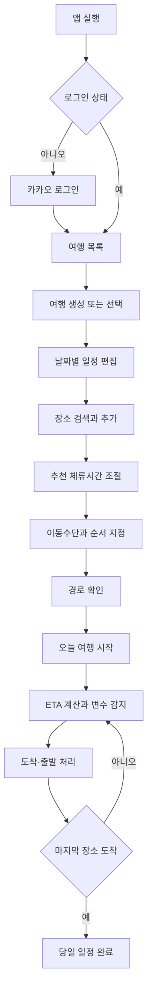
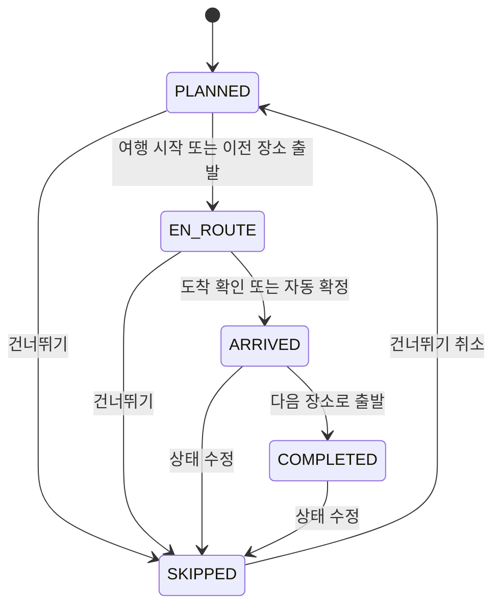
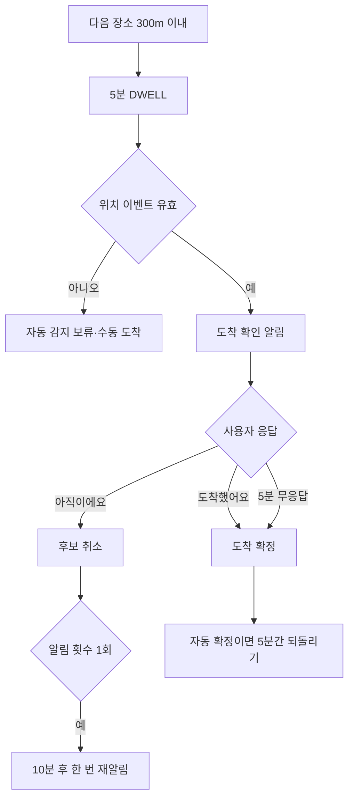
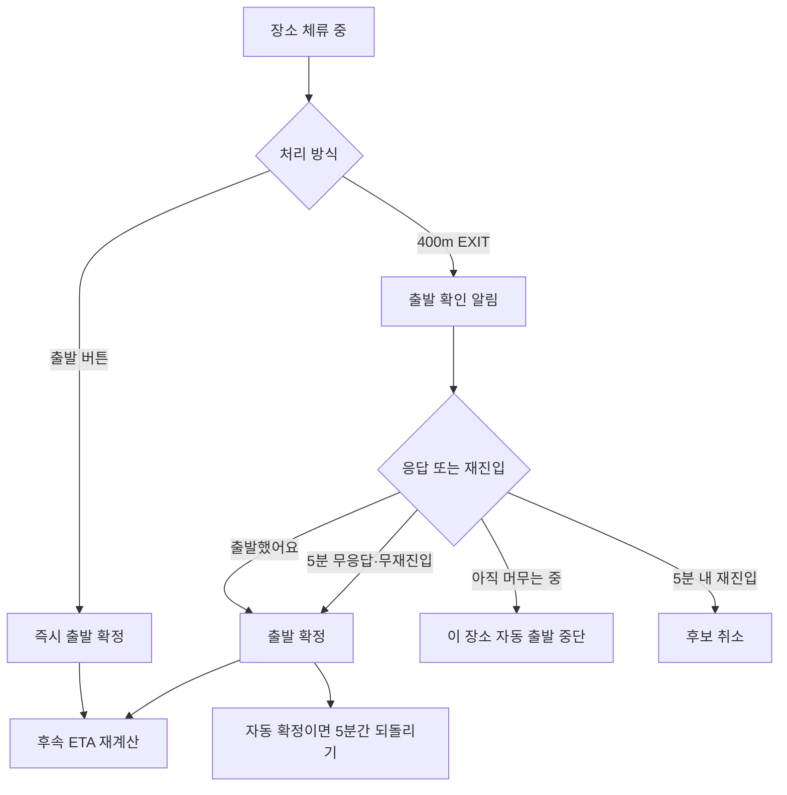
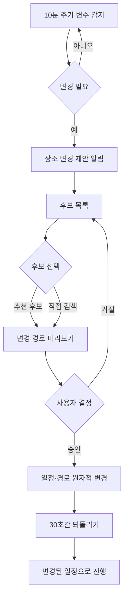

# 길픽 유저 플로우

## 1. 전체 흐름

## 2. 여행 생성·편집

1. 여행 목록에서 새 여행을 선택한다.
2. 2~30자의 여행명과 최대 7일의 기간을 입력한다.
3. 날짜를 선택하고 장소를 검색한다.
4. 장소를 추가하면 카테고리 추천 체류시간이 입력된다.
5. `-30분`, `+30분`으로 30~360분 안에서 조절한다.
6. 장소 순서와 구간별 이동수단을 정한다.
7. 경로 계산 결과를 지도에서 확인하고 저장한다.

기간을 줄이면 삭제될 날짜와 일정 개수를 안내하며, 확인한 경우에만 해당 일정을 삭제한다. 경로 계산이 실패하면 일정은 저장하고 `경로 다시 계산`을 제공한다.

## 3. 여행 목록

- 기본 표시 순서: 여행 중 → 가까운 예정 → 최근 완료
- 여행명 검색과 상태 필터
- cursor 기반 무한 스크롤
- 상태 기준: KST 현재 날짜와 여행 시작일·종료일

## 4. 당일 여행 진행

### 여행 시작

1. 사용자가 `오늘 여행 시작`을 누른다.
2. 서버는 최초 수신 시각을 시작시각으로 고정한다.
3. 유효한 현재 위치가 있으면 첫 장소 ETA에 반영한다.
4. 위치가 없으면 계획 경로 ETA를 표시하고 수동 진행을 허용한다.

### 자동 도착

### 출발

### 가까운 다음 장소

- 이전 장소 EXIT가 없어도 일정 순서상 바로 다음 장소의 DWELL은 감지한다.
- 확인 또는 무응답 자동 확정 시 이전 장소 완료와 다음 장소 도착을 함께 저장한다.
- 다음 장소가 마지막이면 당일 완료와 감지 종료까지 함께 처리한다.
- 되돌리기는 묶인 상태 변경 전체를 복원한다.

### 마지막 장소

마지막 장소 도착이 확정되면 당일 완료 화면을 표시한다. 이후 ETA 계산, 경로 재계산, 변수 감지, 관련 알림, 출발 지오펜스는 실행하지 않는다.

## 5. 대체 장소 흐름

후보가 0.5km에 없으면 1km, 다시 없으면 2km까지 확장한다. 2km에도 없으면 후보 없음 안내와 기존 일정 유지 선택지를 제공한다.

## 6. 위치 권한 예외

| 상황 | 사용자 경험 |
|---|---|
| 정밀 위치 거부 | 현재 위치·실시간 ETA 보정·자동 도착·출발을 끄고 계획 경로와 수동 버튼 제공 |
| 백그라운드 위치 거부 | 앱이 백그라운드일 때 자동 감지를 끄고 수동 버튼 제공 |
| 정확도 100m 초과 또는 2분 지난 이벤트 | 해당 이벤트를 자동 판정에 사용하지 않고 수동 처리 안내 |

